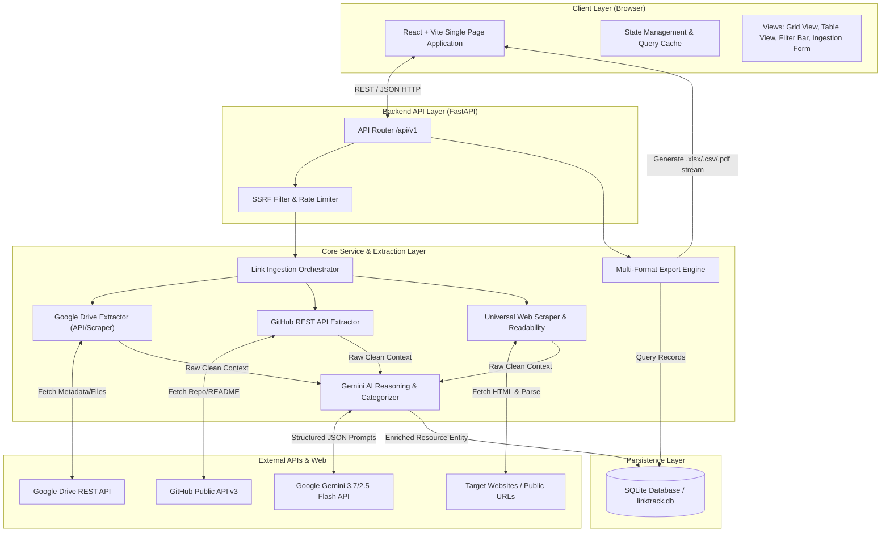
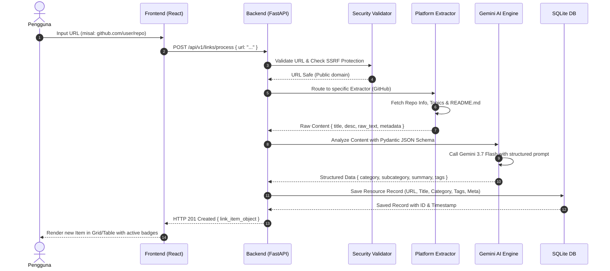
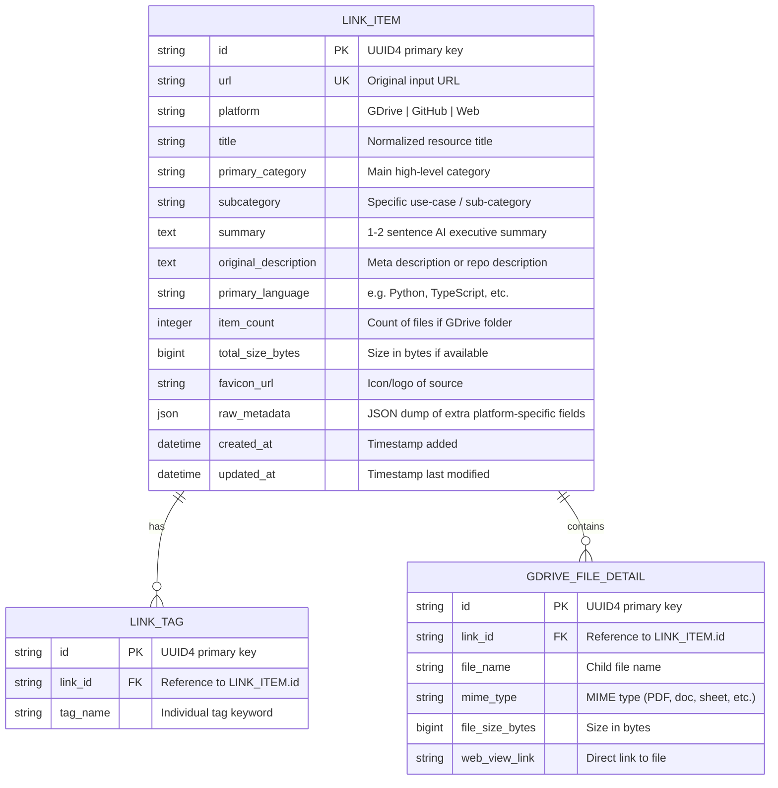

# Software Requirements Specification (SRS)
## LinkSense AI (LinkTrack-App)
*System Architecture, Data Models, API Specifications, and Security Guidelines*

---

## 1. System Overview & Technology Stack

### 1.1 Architecture Paradigm
LinkSense AI dibangun menggunakan arsitektur **Modern Decoupled Full-Stack Web Application**:
- **Backend API Layer**: Python FastAPI / Asynchronous ASGI server yang cepat, modular, dan terintegrasi dengan library data (OpenPyXL, ReportLab/WeasyPrint, BeautifulSoup4, httpx) serta official `google-genai` SDK.
- **Frontend Layer**: Modern Single Page Application (SPA) berbasis React + TypeScript + Vite + Tailwind CSS dengan Lucide Icons dan Framer Motion untuk UI/UX yang dinamis, bersih, dan interaktif.
- **Storage Layer**: SQLite dengan WAL (Write-Ahead Logging) mode untuk penyimpanan persisten lokal yang andal, aman, dan tanpa dependensi server database eksternal yang rumit.

### 1.2 Technology Stack Matrix

| Layer | Komponen / Teknologi | Keterangan & Rationale |
|---|---|---|
| **Frontend Framework** | React 18 / 19 + TypeScript + Vite | Performa tinggi, Hot Module Reload cepat, type safety |
| **Styling & Design System** | Tailwind CSS + Lucide Icons + Modern Glassmorphism | Desain UI modern, responsif, dark/light theme ready |
| **Backend Framework** | FastAPI (Python 3.10+) | Asynchronous I/O, auto OpenAPI docs, Pydantic validation |
| **LLM & AI Engine** | Google Gemini API (`google-genai` SDK) | Model `gemini-3.7-flash` / `gemini-2.5-flash` dengan Structured JSON Output |
| **Extractors & Scrapers** | `httpx` (async HTTP), `BeautifulSoup4`, `readability-lxml` | Ekstraksi konten bersih bebas boilerplate iklan/skrip |
| **Database** | SQLite + SQLModel / SQLAlchemy 2.0 Async | Ringan, zero-config, persisten lokal dengan ACID compliance |
| **Export Engine** | `openpyxl` (Excel), `reportlab` (PDF), `csv` (Native) | Pembuatan spreadsheet dengan hyperlink aktif dan PDF catalog |

---

## 2. System Architecture & Data Flow

### 2.1 High-Level Architecture Diagram



### 2.2 Ingestion & Categorization Sequence Diagram



---

## 3. Database Schema & Data Models

### 3.1 Entity Relationship Diagram (ERD)



### 3.2 JSON Payload Structures (Pydantic / TypeScript Interfaces)

#### AI Classification Response Schema (Gemini Structured Output)
```json
{
  "title": "string (Clean, descriptive title)",
  "platform": "GDrive | GitHub | Web",
  "primary_category": "string (e.g. Frontend Development, Machine Learning, UI/UX Assets, Research & Data)",
  "subcategory": "string (e.g. Component Library, Fine-Tuning Pipeline, Vector Icons, Academic Papers)",
  "summary": "string (1-2 sentences in concise Indonesian/English describing purpose and core functionality)",
  "tags": ["string", "string", "string"],
  "primary_language": "string (if code repository, e.g. Python, TypeScript; otherwise null)",
  "confidence_score": 0.98
}
```

#### Link Item Response DTO
```json
{
  "id": "e4b2d3c1-7a6b-4e12-9c3f-8a1234567890",
  "url": "https://github.com/facebook/react",
  "platform": "GitHub",
  "title": "facebook/react: The library for web and native user interfaces",
  "primary_category": "Frontend Development",
  "subcategory": "UI & Component Framework",
  "summary": "Pustaka JavaScript populer berbasis deklaratif dan komponen untuk membangun antarmuka pengguna web dan native secara reaktif.",
  "tags": ["react", "javascript", "frontend", "ui-library", "declarative"],
  "primary_language": "JavaScript",
  "item_count": null,
  "total_size_bytes": null,
  "favicon_url": "https://github.githubassets.com/favicons/favicon.png",
  "raw_metadata": {
    "stars": 225000,
    "forks": 45000,
    "open_issues": 850,
    "license": "MIT"
  },
  "created_at": "2026-08-21T02:30:00Z",
  "updated_at": "2026-08-21T02:30:00Z"
}
```

---

## 4. REST API Endpoints Specification

### 4.1 Link Management Endpoints

#### `POST /api/v1/links/process`
Memproses single URL baru: ekstraksi data, inferensi AI, dan simpan ke database.
- **Request Body**:
  ```json
  {
    "url": "https://drive.google.com/drive/folders/123456789abcdef"
  }
  ```
- **Response**: `201 Created` $\rightarrow$ `LinkItemResponseDTO`
- **Error Responses**:
  - `400 Bad Request`: URL format invalid atau domain lokal yang dilarang (SSRF protection).
  - `422 Unprocessable Entity`: Ekstraksi konten gagal total atau link privat tak terjangkau.
  - `500 Internal Server Error`: Kegagalan internal server / AI Gateway timeout.

#### `POST /api/v1/links/batch`
Memproses beberapa URL sekaligus dalam mode asinkron batch.
- **Request Body**:
  ```json
  {
    "urls": [
      "https://github.com/fastapi/fastapi",
      "https://drive.google.com/drive/folders/abcdef12345",
      "https://tailwindcss.com"
    ]
  }
  ```
- **Response**: `200 OK`
  ```json
  {
    "total_submitted": 3,
    "successful": 3,
    "failed": 0,
    "items": [ ...array of LinkItemResponseDTO... ],
    "errors": []
  }
  ```

#### `GET /api/v1/links`
Mengambil daftar link dengan query parameters untuk filter, search, pagination, dan sorting.
- **Query Parameters**:
  - `query` (string, optional): Search keyword (mencocokkan judul, summary, atau tag).
  - `platform` (string, optional): `All` | `GDrive` | `GitHub` | `Web`.
  - `category` (string, optional): Filter berdasarkan primary category.
  - `tag` (string, optional): Filter berdasarkan nama tag tertentu.
  - `sort_by` (string, default: `created_at`): `created_at` | `title` | `platform`.
  - `sort_order` (string, default: `desc`): `asc` | `desc`.
  - `page` (int, default: 1), `limit` (int, default: 50).
- **Response**: `200 OK`
  ```json
  {
    "items": [ ... ],
    "total": 42,
    "page": 1,
    "limit": 50,
    "total_pages": 1
  }
  ```

#### `GET /api/v1/links/{id}`
Mengambil detail lengkap 1 item tautan beserta child files jika merupakan Google Drive folder.

#### `PUT /api/v1/links/{id}`
Mengedit manual metadata link (kategori, ringkasan, atau tag).

#### `DELETE /api/v1/links/{id}`
Menghapus item link dari database.

---

### 4.2 Export Endpoints

#### `GET /api/v1/export/excel`
Menghasilkan spreadsheet Excel `.xlsx` dengan styling profesional:
- Header dengan background dark/navy dan font putih tebal.
- Auto-width kolom menyesuaikan isi.
- Kolom URL menggunakan formula/hyperlink hidup `HYPERLINK("...", "Buka Tautan")`.
- Format text wrap pada kolom Summary.
- **Query Parameters**: Mendukung filter yang sama dengan `GET /api/v1/links` (sehingga pengguna dapat mengekspor hasil pencarian/filter aktif).

#### `GET /api/v1/export/csv`
Menghasilkan file CSV standar berkode UTF-8 dengan BOM (agar kompatibel langsung saat dibuka di Microsoft Excel).

#### `GET /api/v1/export/pdf`
Menghasilkan dokumen PDF berformat katalog visual (ReportLab/WeasyPrint) dengan tabel aset, ringkasan, dan link yang dapat diklik.

---

### 4.3 System & Analytics Endpoints

#### `GET /api/v1/analytics/stats`
Mengembalikan statistik koleksi link:
- Total tautan per platform (GDrive, GitHub, Web).
- Distribusi kategori teratas (Top 5 Categories).
- Tag cloud / Top 10 most used tags.

#### `GET /api/v1/health`
Health check status server, database connection, dan API status.

---

## 5. Extractor Module Specifications

### 5.1 `gdrive_extractor.py`
1. **Identifier Resolver**:
   - Memetakan berbagai format URL Google Drive:
     - Folders: `/drive/folders/{folderId}`
     - Files: `/file/d/{fileId}/view`, `/open?id={fileId}`
     - Docs/Sheets: `/document/d/{docId}/edit`, `/spreadsheets/d/{sheetId}/edit`
2. **Data Acquisition Strategy**:
   - Mode 1: Jika API Key / Service Account tersedia $\rightarrow$ query Google Drive v3 REST API (`files.get`, `files.list` dengan `q="'{folderId}' in parents"`).
   - Mode 2: Fallback scraping metadata publik (OpenGraph title, description, schema.org) jika token API tidak dikonfigurasi.
3. **Output Normalization**: Mengembalikan nama file/folder, MIME type, ukuran total, perkiraan jumlah file, dan status aksesibilitas publik.

### 5.2 `github_extractor.py`
1. **Identifier Resolver**: Mengekstrak `owner` dan `repo` dari pola `github.com/{owner}/{repo}`.
2. **Data Acquisition**:
   - Memanggil GitHub REST API `/repos/{owner}/{repo}` (mengambil name, description, stars, forks, language, topics, license, default branch).
   - Memanggil `/repos/{owner}/{repo}/readme` dengan accept header `application/vnd.github.v3.raw` untuk mengambil teks murni `README.md`.
3. **Content Cleansing**: Menghapus badge markdown (shield.io), komentar HTML, dan memotong teks README hingga maksimal 8.000 karakter sebelum disuplai ke prompt Gemini.

### 5.3 `web_scraper.py`
1. **Request Engine**: Menggunakan `httpx.AsyncClient` dengan timeout 10s, follow redirects, dan header User-Agent browser modern.
2. **Parser & Cleaner**:
   - Ekstraksi meta tag: `og:title`, `og:description`, `og:image`, `twitter:title`, `meta[name="description"]`, `<title>`.
   - Menggunakan heuristic / BeautifulSoup untuk membersihkan tag `<script>`, `<style>`, `<nav>`, `<footer>`, `<aside>`, dan mengambil teks artikel utama.

---

## 6. AI Reasoner & Gemini API Implementation Details

### 6.1 SDK & Model Selection
- SDK: `google-genai` (Official Google GenAI SDK for Python).
- Model: `gemini-3.7-flash` (atau fallback `gemini-2.5-flash` / `gemini-3.5-flash-lite`).
- Mode: **Structured Outputs** dengan `response_mime_type="application/json"` dan `response_schema=PydanticModel`.

### 6.2 System Prompt Specification
```
Anda adalah sistem AI Information Architect dan Knowledge Curator tingkat dunia.
Tugas Anda adalah menganalisis data mentah sebuah tautan (Google Drive, GitHub, atau Web), kemudian menghasilkan metadata taksonomi bertingkat yang rapi, ringkas, dan sangat informatif dalam Bahasa Indonesia.

Hirarki Taksonomi:
- Platform: Tentukan secara akurat (Google Drive, GitHub, atau Web).
- Primary Category: Pilih kategori utama yang baku (misal: "Frontend Development", "Backend & API", "AI & Machine Learning", "Data & Research", "Desain & Aset Grafis", "DevOps & Cloud", "E-book & Edukasi", "Produktivitas & Tools").
- Subcategory: Tentukan use-case spesifik (misal: "UI Component Library", "Dataset Kanker Paru", "3D Model Asset", "Dokumentasi Arsitektur").
- Summary: Buat 1-2 kalimat padat yang menjelaskan apa fungsi utama resource ini dan mengapa ini berguna bagi pengguna.
- Tags: Berikan 3-6 tag spesifik, huruf kecil, tanpa spasi (gunakan tanda hubung).
```

---

## 7. Security, Resilience & Error Handling

### 7.1 SSRF (Server-Side Request Forgery) Prevention
Sistem memeriksa semua URL sebelum melakukan HTTP request:
- Memastikan skema hanya `http` atau `https`.
- Resolusi DNS untuk memastikan target IP bukan:
  - Private IP (`10.0.0.0/8`, `172.16.0.0/12`, `192.168.0.0/16`)
  - Loopback (`127.0.0.0/8`, `::1`)
  - Link-local / Cloud Metadata endpoint (`169.254.169.254`)

### 7.2 Rate Limiting & Graceful Degradation
- Fast API Rate Limiting: 60 requests per minute per IP untuk endpoint scraping/AI.
- Gemini API Retries: Menggunakan exponential backoff dengan jitter untuk status code 429 atau 503.

### 7.3 Data Integrity & Concurrency
- SQLite dikonfigurasi dengan `PRAGMA journal_mode=WAL;` dan `PRAGMA busy_timeout=5000;` untuk mencegah database locking saat write concurrent.

---

## 8. Verification & Test Plan

1. **Unit Tests (`pytest`)**:
   - Test parser regex untuk berbagai format URL (Google Drive folder, GitHub repo link, generic URL).
   - Test generator Excel (validasi MIME type `.xlsx`, verifikasi formula hyperlink, verifikasi styling header).
   - Test validasi SSRF (memastikan `http://localhost:8000` atau `http://169.254.169.254` di-reject).
2. **Integration Tests**:
   - Mock response GitHub REST API & Gemini API untuk menguji alur ingestion end-to-end tanpa menghabiskan kuota API.
3. **E2E Smoke Tests**:
   - Verifikasi UI: Form submit, filter per platform, search real-time, dan trigger download file Excel/CSV/PDF.
